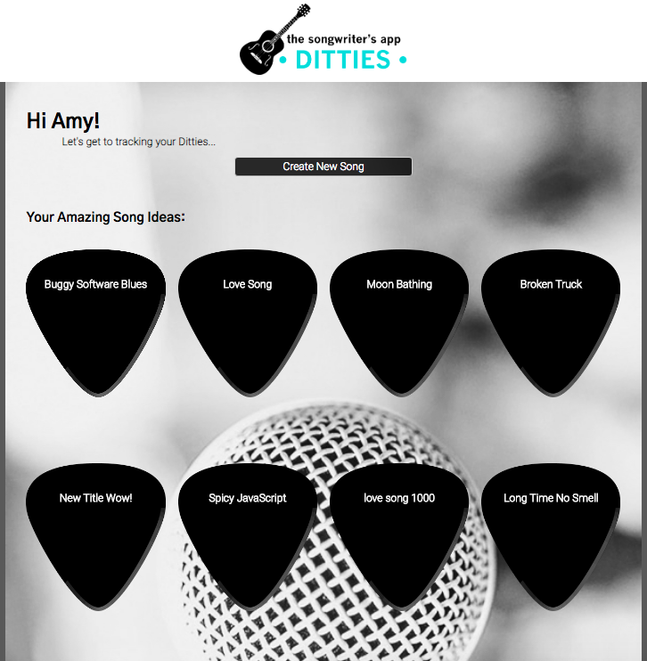
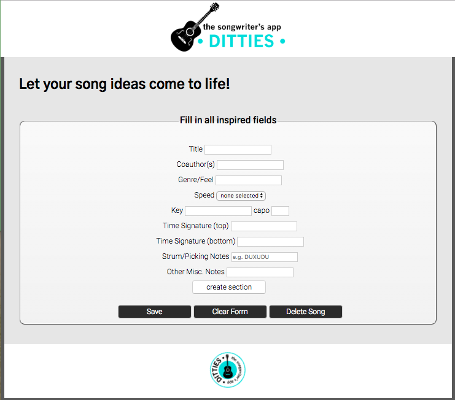
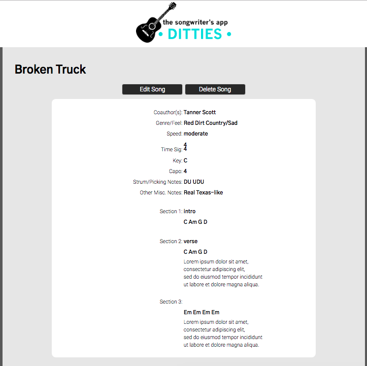

# Ditties | The Songwriter's App

Where useres can create and track their amazing song ideas.

[See the live app here](https://cryptic-atoll-45082.herokuapp.com/)

## Landing Page
Users can log into their existing account, access a Demo account, or link to the registration page to sign up. Once logged in, users are taken to their dashboard.

## Registration Page
Users can register for a new account by entering credentials and submitting. Passwords must be at least 10 characters. Passwords are then encrypted, and the user is issued an authentication code. Once registered, the user is logged in. Users can also opt to return to the landing page to log in with an existing account.

## Dashboard
Once logged in, users are taken to their dashboard. They are greeted by first name. They can click to create a new song. They can also see all of their existing songs. Two of the represented songs are examples seeded to the database. These are the only two songs that all users can access and that no user can delete. All songs are represented as buttons shaped like guitar picks. Clicking the "create new song" button takes the user to the Song Form Page. Clicking any of the titled guitar picks takes the user to that Song Page for viewing.

## Song Form Page
Users are directed here to create a new "ditty." The only requirement is a title. This allows the user to be free to take note of any and all song ideas as they come. Every songwriter has a different process, and each song is inspired differently. To create a new section in the song, a button appends more form fields. To return to the Dashboard without saving, the user can click anywhere on the navigation bar. If the user selects "save" without a title, they are alerted with a confirmation. They can choose to exit to the Dashboard without saving or return to finish the form. They can also select "delete," and, after a confirmation alert, they will return to the Dashboard. They can clear the form and start over. If the user selects "save" with a filled title, they are directed to the Song Page for viewing.

 

## Song Page
Users view one "ditty" at a time from this page. They can return to the Dashboard by clicking anywhere on the navigation bar. Users can choose to delete the song. After a confirmation alert they are directed to their Dashboard, where the deleted song will be missing. Users can choose to edit the song. When they click "edit" they are directed to a new version of the Song Form Page with pre-filled fields.

## Technologies
* HTML
* CSS
* JavaScript
* jQuery
* Node.js
* Express
* MongoDB
* Mongoose
* Mocha
* Chai
* Chai-http
* Travis CI

## Author
Amy Speed-Henley